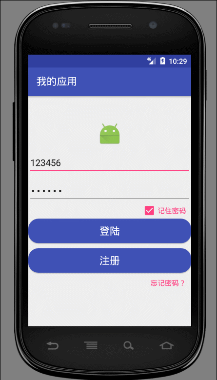
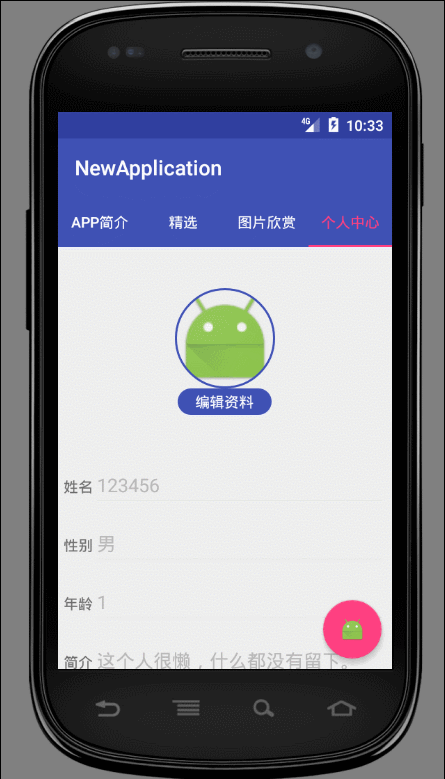

# **功能**








# **引用的第三方库**

1. ```
   cn.bmob.android:bmob-sdk:3.5.5；
   ```

2. ```
   de.hdodenhof:circleimageview:2.1.0；
   ```

3. ```
   com.kymjs.rxvolley:rxvolley:1.1.4；
   ```

4. ```
   com.squareup.picasso:picasso:2.5.2；
   ```

5. ```
   com.github.chrisbanes:PhotoView:2.0.0；
   ```


