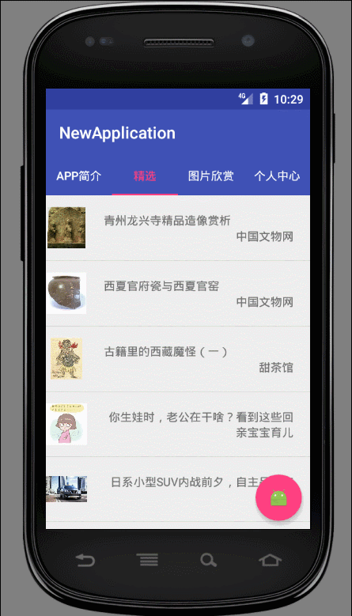

# **功能**





# **后续要添加的功能及修改**

1. 侧边栏功能；
2. 精选内容下拉加载上拉刷新功能；
3. 图片缩放功能；
4. 检查更新功能；
5. 将简介转移到设置页里；
6. 等等。

# **引用的第三方库**

1. ```
   cn.bmob.android:bmob-sdk:3.5.5；
   ```

2. ```
   de.hdodenhof:circleimageview:2.1.0；
   ```

3. ```
   com.kymjs.rxvolley:rxvolley:1.1.4；
   ```

4. ```
   com.squareup.picasso:picasso:2.5.2；
   ```

5. ```
   com.github.chrisbanes:PhotoView:2.0.0；
   ```

# **总结**

#### 转行自学半年多的第一个半成品APP，看着很简陋，但是还是发了上来，后续不断的改进，也算是迈出了我的第一步，(￣▽￣)"加油啦~


